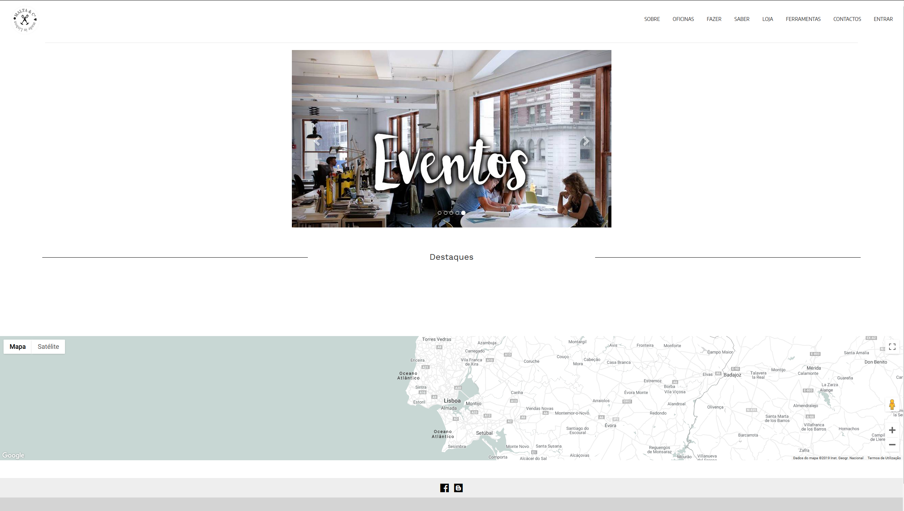

# LDSO Software Development Laboratory
Projects made in Software Development Laboratory class - MIEIC 4y1s 

# Malta&Cª
This project had our team create a website for craftsman. The requirements were to have a database of craftsman, with each of the craftsman having a profile page with media and other personal information. The website should also have an store with a integrated payment system, search capabilities for the users to search by materials, region, city, craft, etc. An interactive map with all of the information specified until now, integrated in the map. Blog, events pages and users registration capabilities.
This class had us organize in a small company with a scrum master, product owner and the rest of the team, as developers. Being that the time to do all of this was 2.5 months, I think that the fact that our team had all of the requirements done in that time, showed that the team is very capable and worth of trust when dealing with a great ammount of work. This class also showed that the client's need to be handled with care, as they don't have realistic expectations and don't always know what they want.

## How to run
First you need to install "python 3.6" and "MySQL".

Setup MySQL:

 - Download MySQL community:
https://dev.mysql.com/downloads/windows/installer/5.7.html

 - Create Database:
Open MySQL console and insert:
>
> CREATE DATABASE MaltaC CHARACTER SET UTF8;
>
> CREATE USER mysqlDBUser@localhost IDENTIFIED BY 'maltaDBpassword';
>
> GRANT ALL PRIVILEGES ON MaltaC.* TO mysqlDBUser@localhost;
>
> FLUSH PRIVILEGES;
>
> exit

At this time a database named "MaltaC" with user "mysqlDBUser" and password "maltaDBpassword" is created.

To populate the Database with test data, run:
> python DBinsertTestData.py

As its a Django application, to run, simply create an virtual environment install the requirements specified in "requirements.txt" and run the django application with the command:
> python MaltaeC/manage.py runserver

Our team original repository: https://gitlab.com/killghost15/MaltaeC
Test website: https://maltacompanhia.herokuapp.com/
